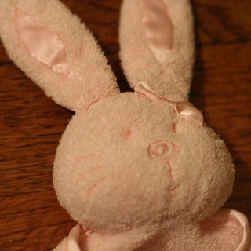
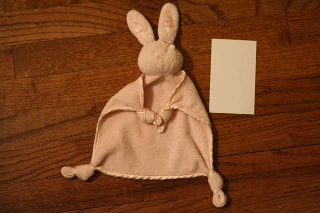
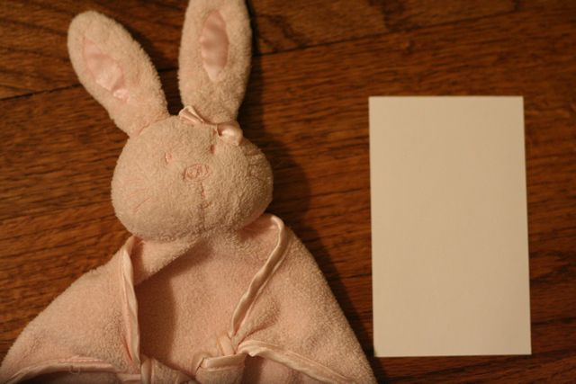

<html>
<head>
<title>Have you seen this Bunny?</title>
</head>

<body>
Have you seen this Bunny?
==========

[Ellie](http://ellieivey.com) has developed an attachment to Flat
Bunny.  Honestly, I expected it to be Flat Baby, and Emily of course
was counting on Night Night, but you can't pick what the kid will
fixate on.

So, just to be on the safe side, we'd like to get a backup. Not that
we have any plans for swapping Flat Bunny with an imposter...but stuff
happens, and if she's going to need something to get to sleep, I need
to make sure I have a Plan B.  And maybe a Plan C.

Flat Bunny was a gift from a knitter friend of Emily's. We're trying
to track down the origins through her, but if any of you have a lead
on any details about this bunny, please let me know.

Here's a picture of Flat Bunny, with a 3x5 index card for scale.

Here's a closeup.

</body>
</html>
